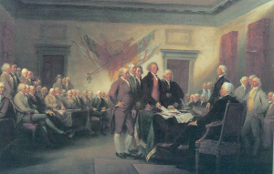
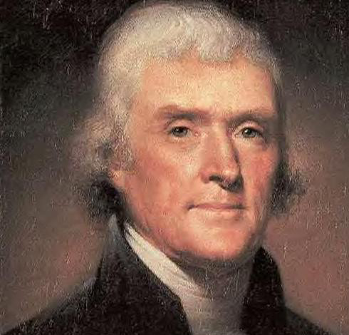
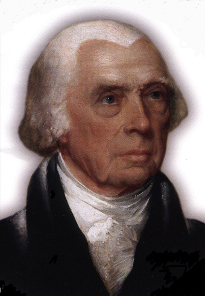

# National Citizen's Initiative for Democracy

# Realizing the Full Promise of our Founders
- The National Ballot Initiative

# Representative Government
- The Primary Power of Government is lawmaking – not voting for politicians
- On Election Day voters give their power away to politicians
- Result: politician/representatives  have a monopoly on lawmaking

# Failure of Representative Government
- Human nature dictates that the self-interest of representatives takes precedence over the interest of the People 
- As a result representatives fail to address critical issues
- Their main concern is to stay in power 

# Decision Making Process of Elected Officials
- “How will this affect my reelection?”
- “How will this affect those who put up the money to get me here and keep me here?”
- “How will this affect my party since I share power when my party is in control?”

# Structure of Representative Government
- Because of human nature, representatives do not put the interest of those they represent above their own
- Obviously representatives cannot correct this systemic problem
- The problem is inherent in the structure of  representative government 

# Venues for Change
- There are only two venues for political change 
- The government wherein the problem exists 
- Or the People, from whom all political power emanates 

# The People as Lawmakers
- Lawmaking requires a detailed deliberative process
- The U.S. Constitution does not provide  procedures for the People to amend the Constitution or make laws
- The People, as sovereigns, implicitly  have that power to amend the Constitution and make laws 

# The National Ballot Initiative
- To assert their implicit lawmaking power, the People must enact:
- A legislative package that includes...

# The Democracy Amendment
- asserting the power of People to make laws
- creating an Electoral Trust
- limiting donations in National Initiative elections to natural persons
- enacting the National Ballot Initiative by the People as the law of the land through a self-ratifying  national electoral process 

# The Democracy Statute
- Establishes deliberative legislative procedures
- These procedures are similar to those of the Congress and most State Legislatures
- The Electoral Trust administers these procedures on behalf of the People
- The People’s power to enact the National Initiative is derived from:
- The actions of the Founding Generations of Americans 
- The Declaration of Independence 
- The Revolutionary War that guaranteed that American Independence 
- The views  of the Founding Fathers

# Declaration of Independence

- We hold these truths to be self-evident, that all men are created equal, that they are endowed by their Creator with certain unalienable rights, that among these are life, liberty and the pursuit of happiness. That to secure these rights, governments are instituted among men, deriving their just powers from the consent of the governed. That whenever any form of government becomes destructive to these ends, it is the right of the people to alter... it.

# George Washington 1787
 "People can decide with as much propriety on the... amendment, of the Constitution, ...as ourselves, for I do not conceive that we... have more wisdom or possess more virtue than those who will come after us."

# Thomas Jefferson 1812
 "Unless... the people retains sufficient control over...representative governments it will be perverted... to the perpetuation of wealth and power in the individuals... selected for the trust.”

# James Madison 1787
 "The People were, in fact, the fountain of all power, and by resorting to them, all difficulties were got over. They could alter constitutions as they pleased."

# James Wilson 1789
 "All power is originally in the People and should be exercised by them in person, if that could be done with convenience, or even with little difficulty."

# Founders vs. Framers
- Founders: Leaders of the Revolutionary Generation
- Framers: Authors of the Constitution in 1787
- Founders recognized the implicit power of the People as Lawmakers
- Framers pushed the People’s power aside

# Climate of Compromise in 1787
- Highly inflated Independent state currencies
- Each state had its own independent foreign & trade policies 
- State conflicts over western lands
- Threatening presence of British, Spanish and French on the frontiers 
- Shay’s rebellion over taxation in Massachusetts 
- No one in Europe expected the Confederate States to survive 

# Constitutional Convention 1787
- Goal: create a central federal government to correct the chaotic situation of the Confederate government
- The main barrier to realizing that goal was the existence of slavery.
- The perpetuation of slavery in the Constitution was one of the first moral compromises in American history

# The Casualty of Compromise
- The Framers were informed by the People’s rejection of a Massachusetts constitution in 1778 that perpetuated slavery 

- As a result, the Framers sacrificed the principle of the Declaration of Independence and the views of the Founding Fathers that the People, as lawmakers, can directly alter their government

#  Slavery Force Undemocratic Elements into the Constitution
- A slave was 3/5 of a person for calculating representation in the Congress
- The Electoral College gives precedence to States rather than to the population of states in calculating votes for presidents 
- Article V only allows  representatives in government to amend the  Constitution 
- Creation of the U.S. Senate voided the democratic effect of the national population
- State and local governments control the elections of Federal officials 

# Constitution’s Undemocratic Adoption
- By using conventions to ratify the Constitution, the Framers excluded the People from the ratification process 
- As a result, they denied the People their sovereign legislative power to directly create the United States Government.

# Effect of Pushing the People Aside
- Representatives gained a monopoly on lawmaking
- This monopoly of power led to excesses in government and control by economic elites
- This produced unrestricted capitalism and extreme government corruption
- This encouraged class conflict and social violence

# The Progressive Movement
- At the turn of the century progressives enacted initiative, referendum and recall laws (IRR) at the state level
- IRR law have since been enacted in 24 States and more than 200 local communities
- Empowering the people as lawmakers at the state level was the most significant development in American governance since the ratification of the Constitution

# Shortcomings of IRR Laws
- IRR laws lack deliberative and support procedures that exist in all representative legislatures
- Representative government controls the IRR process and continually attempts to erode the peoples lawmaking powers 
- Unlimited corporate money corrupts the IRR process
- Citizens cannot legislate independently of their elected representatives

# The People’s Legislative Record
- The people have enacted more than 1,000 state laws in the last 100 years
- In spite of inadequate initiative legislative procedures, the people’s record is as good as any legislative body in the United States
- With respect to fiscal matters, the People’s record at the state and municipal levels of government is far superior to that of their elected officials because the People know it’s their money

# The Obvious Questions
- Why can’t the people make laws at the national level as the majority of Americans already do at the state and local levels?
- Have Americans forgotten that the Founding Fathers felt that future generations had the right and the obligation to make laws?

# Current Obstacles to People’s Lawmaking
- **The Congress** does not want to give up its monopoly on legislative power
- **The Media** serves as the intermediary between the government and the people and does on want to dilute its power either
- **The People** distrust certain individuals and fear manipulation by small groups  because they fail to appreciate that legislative decisions will be made by the majority of the electorate
People’s lawmaking requires unreserved faith in the people

# Enacting the National Ballot Initiative
- We, the people,  can establish processes to enact the National Ballot Initiative using Article VII as precedent and modern technology, which enables us to ask all Americans if they want to be empowered as lawmakers
- The first element process is a national election conducted by  a private nonprofit corporation, Philadelphia II, giving Americans the opportunity to vote to enact the National Ballot Initiative
- The second element establishes the standard: that the majority of the people who voted in the last presidential election vote affirmatively for the  National Ballot Initiative thereby making it the law of the land

# The Effect of Empowering the People
- For the first time in our history, a Government will be created not only Of and For the People, but also   **By the People**
- Eliminating  the monopoly of representative government will unleash the awesome power of individual and collective human creativity
- It’s time to fully realize the genius and promise of our Founders’ concept of self-government 

# If the People Could Make Laws
- We, the people, could end the Iraq War immediately
- We, the people, could establish a national single payer universal health care system
- We, the people, could make our tax system fair and transparent
- We, the people, could legislate on all policy questions that affect our lives
# It’s Up To you!
To enact:
- **The National Ballot Initative** by going to and voting for: http://www.ncid.us/

# Questions?
